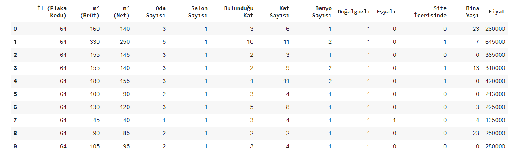
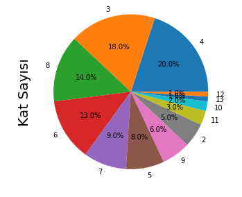
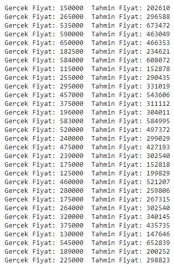

## House Price Prediction Application with XGBoost Regressor and Linear Regression Method

### Kullanılan veri alanları
- İl (Plaka Kodu)
- m^2 (Brüt)
-  m^2 (Net)
- Oda Sayısı
- Salon Sayısı
- Bulunduğu Kat
- Kat Sayısı
- Banyo Sayısı
- Doğalgazlı olup olmaması (Doğalgazlı ise 1 değil ise 0)
- Eşyalı olup olmaması (Eşyalı ise 1 değil ise 0)
- Site İçerisinde olup olmaması (Site İçerisinde ise 1 değil ise 0)
- Bina Yaşı
- Fiyat

#### Tablo 

#### Kat Sayısına Göre Daire Grafiği 

#### Tahmin sonuçları 

